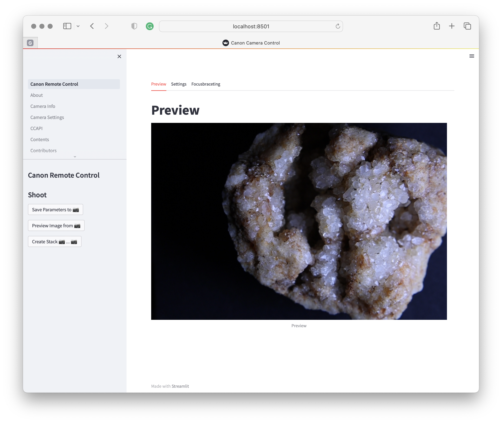
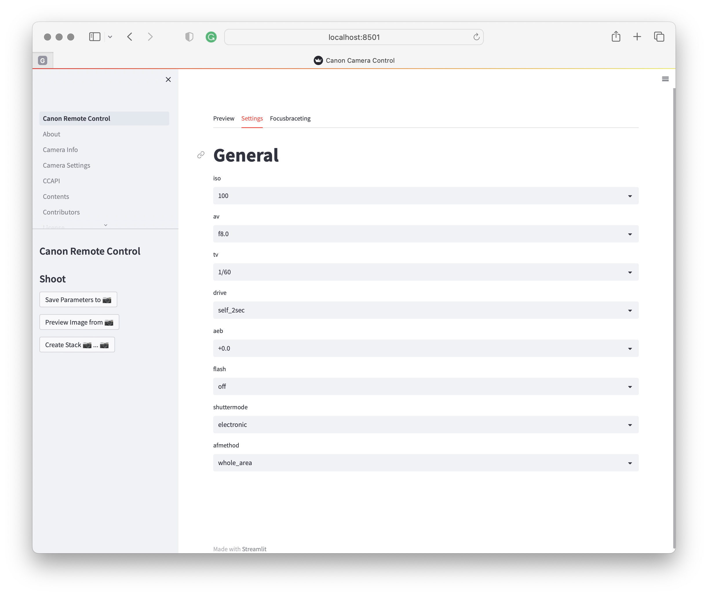
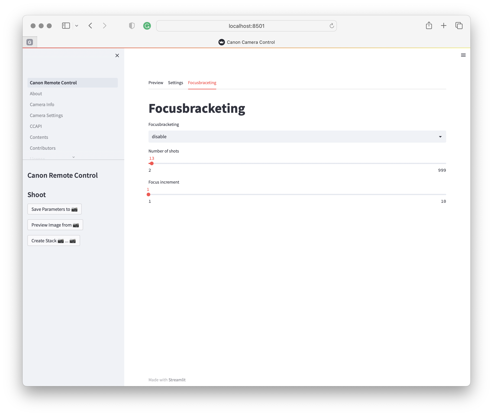

# canon-r7-ccapi

## The problem

Many people noticed that the regular EOS Utility program has issues
on some Macs. This happens only via WiFi. The USB connection works fine.
However, we like to be able to access the Cannon cameras via WiFi read-on.
Furthermore, not all features are supported on Android apps interfacing with 
the canon camera so this is unfortunately yet not an option.
I use it to control focus bracketing from a computer.

Please note this only works for the models as documented at
* https://developers.canon-europe.com/developers/s/article/Latest-CCAPI
* Version: 1.3.0 (Released on 12th December 2022)

This includes:

* EOS R6 Mark II,
  EOS R7,	
  EOS R10,	
  EOS R3,
  EOS M50 Mark II,	
  EOS R5,
  EOS R6,
  EOS 850D,	
  EOS-1D X Mark III, 
  EOS M200,
  EOS 90D,
  EOS M6 Mark II,
  PowerShot G5 X Mark II,
  PowerShot G7 X Mark III,
  EOS 250D,
  EOS RP,
  PowerShot SX70 HS

Note that you need to likely update your firmware. Firmware update is rather simple on the Canon cameras, you download it, put it on your SD card, select firmware update then wait patiently when done. Make sure you have a fully charged battery. Do not power down during firmware upgrade. Read the canon instructions for this,

## The solution

The method chosen here uses the official CCAPI that relies on a REST service
calls in the network shared between the camera and the computer. The following
features are available:

* Elementary Python library to control many of the camera
* Elementary GUI interface to run the program from a GUI
* Ability to run the GUI on Linux, macOS, Windows 10, Windows 11
* Expandable
* demonstration on how to use the library in jupyter notebooks so you can create easily interactive workflows.

For example, With this GUI it is possible to conduct focus bracketing remotely. Many
features of the camera can be controlled remotely.

As the program uses CCAPI it can be likely used for other cameras also.
Make sure your camera is compatible

... more will be added here

## Install

```bash
$ git clone https://github.com/laszewsk/canon-r7-ccapi.git
$ cd canon-r7-ccapi
$ pip install -e .
$ export CANON_IP=<Your canon camera ip address>
$ make
```

Those will install and run the program using a GUI.

Future:

The following is not yet supported and tested

```bash
pip install conon-r7-ccapi
crc
```

## GUI Interface

The program also provides a minimal GUI interface that could be 
enhanced with additional features. It serves also as an example
on how to use the API.

The GUI has three tabs: Preview, General, Focusbracketing

A Preview will apear when the "Preview from Camera" is pressed.
In General you can set most parameters controlling the camera.
In Focus bracketing you can set some parameters to control focus bracketing.

Additional menu items are available in the sidebar, such as listing the content
of the SD Cards and so on.

Here are the screenshots of the three Tab windows.



**Figure 1:** Screenshot of the preview tab.



**Figure 2:** Screenshot of the General tab.



**Figure 3:** Screenshot of the focus bracketing tab.

## API

The python API we developed is simple and its elementary python 
use is documented in the following 
[Jupyter notebook](examples/notebook.ipynb). 


## Notebook

The  
[Jupyter notebook](examples/notebook.ipynb) is available from Github.
For the notebook we use 
a different GUI that is based in ipywidgets.
It is also documented in [medium.com](https://medium.com/@laszewski/using-jupyter-notebooks-to-control-your-canon-camera-936d6b5ac0a4).

Using Jupyter allows one to write simple interactive workflows for manipulating images.


## Plan


* manual
* documentation of the API
* writing an article for a hacker magazine/web site
* showcasing the macro stand
* evaluate integration with WeMacro

## Other Links

* Canon video tutorial https://www.youtube.com/watch?v=NwFHUGYzC3Y
* JavaScript based examples https://dphacks.com/how-to-canon-camera-control-api-ccapi/
* Canomate https://www.testcams.com/canomate/


